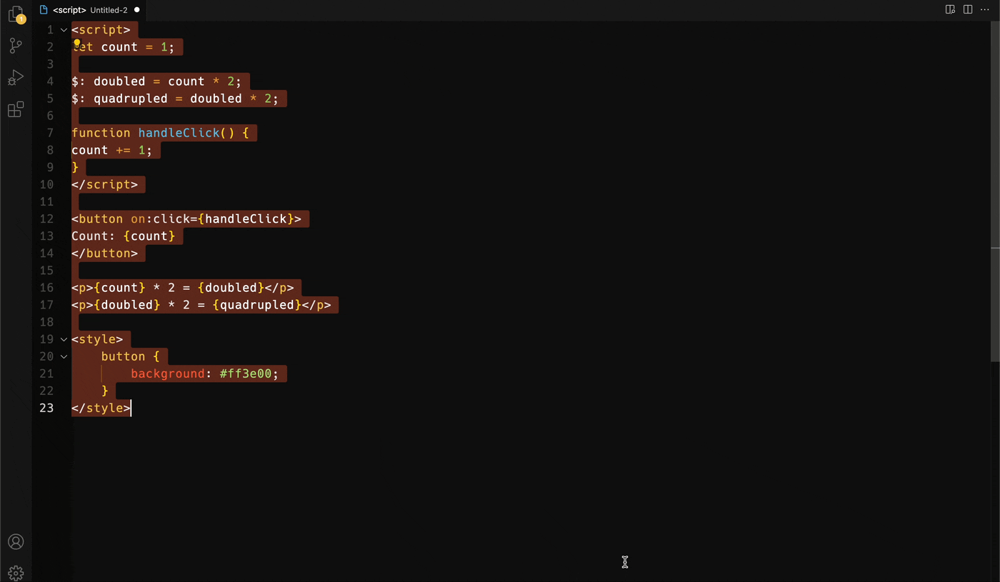

# vs-highlight (WIP)

Generate code snippets with [highlight.js](https://highlightjs.org/)

[Supported languages (github.com/highlightjs)](https://github.com/highlightjs/highlight.js/blob/main/SUPPORTED_LANGUAGES.md)
 

**Contents:**
- [Features](#features)
- [Commands](#commands)
- [Keybindings](#keybindings)
- [Release Notes](#release-notes)
	- [1.0.0](#100)
- [Todo](#todo)

 

## Features

> Convert the current selection:

 

 

## Commands

- `vs-highlight.highlightSelection` Generate snippet from selection.
- `vs-highlight.insertThemeStyles` Insert theme CSS.

 

## Keybindings

- <kbd>ctrl</kbd> + <kbd>0</kbd> - Generate snippet from selection.
- <kbd>ctrl</kbd> + <kbd>9</kbd> - Insert theme CSS.

 

## Release Notes

### 1.0.0

Initial release.

 

## Todo

- [x] Convert to typescript.
- [x] Add command to insert a highlight.js theme that can be selected from a list.
- [ ] Add outputToClipboard setting.
- [ ] Github Gist integration.
- [ ] Write tests.
- [ ] Add a webView / web component for previewing the generated markup.
- [ ] Generate a theme from the current `vscode.window.activeTextEditor` color theme.
- [ ] Create a highlight.js extension to highlight with tailwindcss class names.

<!-- 
## Requirements
## Settings
## Known Issues
-->
